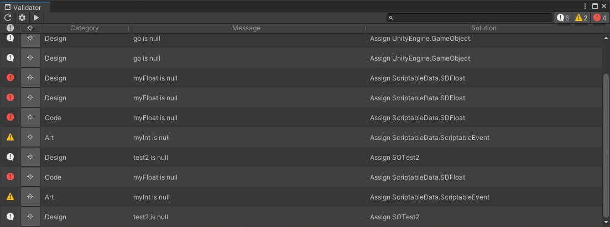

# Validator



Unity project validator framework.

## Getting Started
Add a custom validate check using the `IValidatable` interface:
```C#
using Validator;

public class MyBehaviour : MonoBehaviour, IValidatable
{
    [SerializeField] private float startHealth = 10; // If someone was to put it to low <= 0, it would be invalid.

#if UNITY_EDITOR
    public void Validate(Report report)
	{
        	// Check if health is valid.
		if(startHealth <= 0)
		{
            		// If not, log it.
			report.Log(this, WarningType.Warning, ReportCategories.Design, $"{nameof(startHealth)} is to low", $"Make value > 0");
		}
	}
#endif
}
```

Add a validate check using `[Required]` attribute:
```C#
[SerializeField, Required] private GameObject playerPrefab = null; // If someone forgets to assign it, it would be invalid.
```

Open Validator Window:
> Window -> General -> Validator

Run the validator:
> Click the 'run/play' button and wait for the report to be generated.

## Install

[Installing from a Git URL](https://docs.unity3d.com/Manual/upm-ui-giturl.html)

## LICENSE

Overall package is licensed under [MIT](/LICENSE.md), unless otherwise noted in the [3rd party licenses](/THIRD%20PARTY%20NOTICES.md) file and/or source code.
